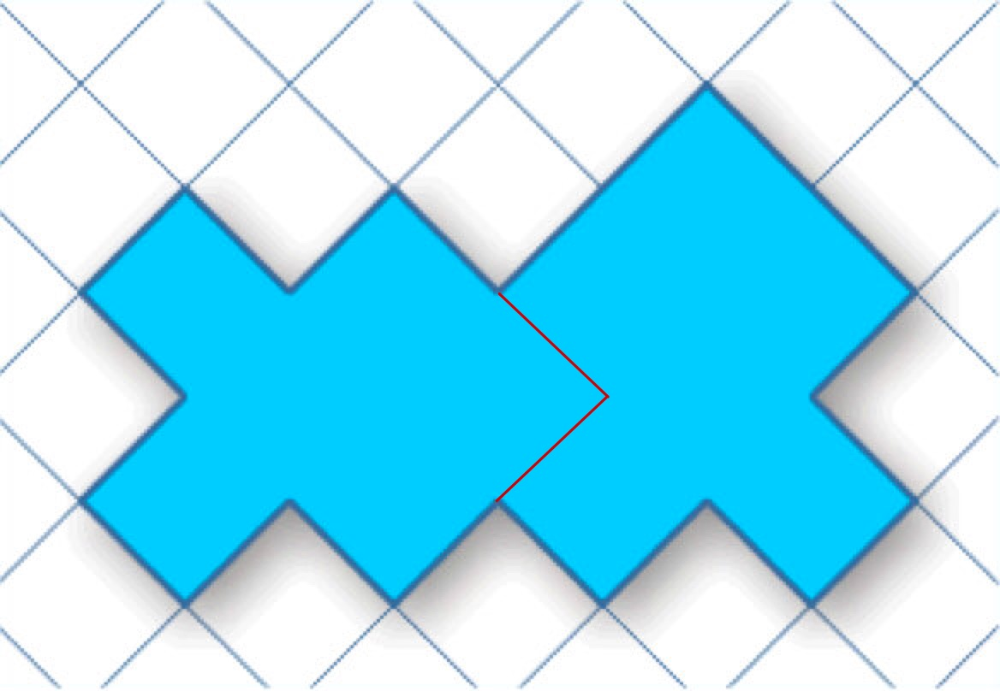

# My solution to the crazy cut puzzle

You can break the image down into a bunch of squares then from there you just need to come up with a way to equalize the number of squares on both sides of the picutre, this appears to work

